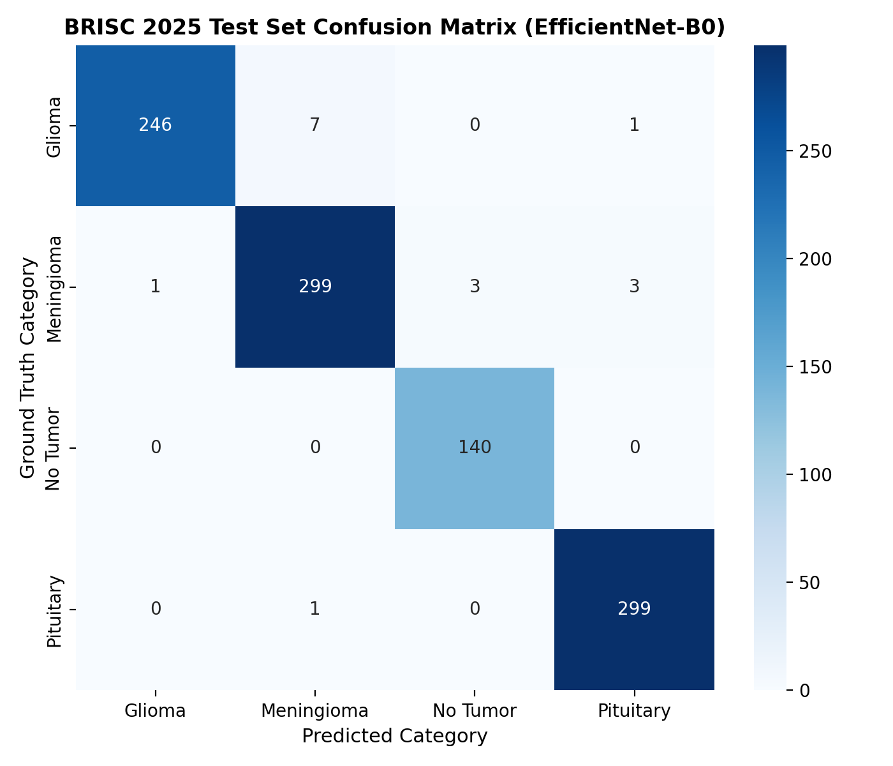

# Classification Model Evaluation Report

**Model Architecture**: EfficientNet-B0 (Transfer Learning)  
**Total Parameters**: 4,012,672  
**Checkpoint Path**: `models\classification\efficientnet_b0_brisc.pth` (15.59 MB)  
**Dataset**: BRISC 2025 Test Split (1000 scans across 4 classes)  

---

## Benchmark Performance

| Metric | Score |
|---|---|
| **Overall Test Accuracy** | **98.40%** |
| **Macro-Averaged F1 Score** | **0.9847** |
| **Test Cross-Entropy Loss** | **0.0661** |

---

## Detailed Classification Metrics
```
              precision    recall  f1-score   support

      glioma       1.00      0.97      0.98       254
  meningioma       0.97      0.98      0.98       306
    no_tumor       0.98      1.00      0.99       140
   pituitary       0.99      1.00      0.99       300

    accuracy                           0.98      1000
   macro avg       0.98      0.99      0.98      1000
weighted avg       0.98      0.98      0.98      1000

```

---

## Confusion Matrix Heatmap

