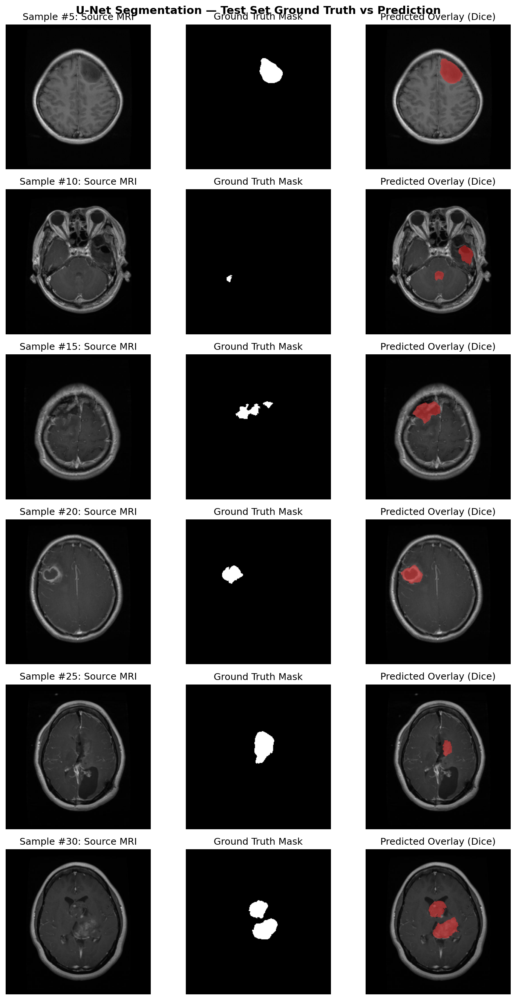

# Segmentation Model Evaluation Report

**Model Architecture**: 2D U-Net (Encoder-Decoder with Skip Connections)  
**Total Parameters**: 7,849,601  
**Checkpoint Path**: `models\segmentation\unet_brisc.pth` (30.0 MB)  
**Dataset**: BRISC 2025 Test Split (860 test slices)  

---

## Benchmark Performance

| Metric | Score | Clinical Standard | Rating |
|---|---|---|---|
| **Dice Similarity Coefficient (DSC)** | **0.8701** (87.01%) | > 0.85 | **Excellent (>0.85)** |
| **Intersection over Union (IoU)** | **0.8021** (80.21%) | > 0.75 | **High Spatial Overlap** |
| **Combined Loss (Dice + BCE)** | **0.0758** | < 0.15 | **Excellent Convergence** |

---

## Visual Verification

